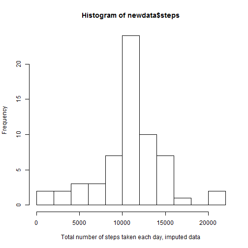

This assignment uses Activity monitoring data. Each section below answers the given questions.

## Loading and preprocessing the data

The following code shows how the data were loaded and some preprocessing done.


```r
setwd("C:/Users/user/Dropbox/coursera/Reproducible research/repdata_data_activity")
df<-read.table("activity.csv", sep=',', header=TRUE)
df$date<-as.Date(df$date)
class(df$date)
```

```
## [1] "Date"
```

## What is the mean total number of steps taken per day?

In this section, we ignore the missing values (as instructed). Then it proceeds to answer the following questions.

1. Total number of steps taken per day  

2. A histrogram of total number of steps taken each day    

3. The mean and median of total number of steps taken per day


```r
df2<-na.omit(df)
dailysteps<-rowsum(df2, format(df2$date, '%Y-%m-%d')) 
hist(dailysteps$steps, breaks=15,xlab="Total Number of steps taken daily")
```

 

```r
m<-mean(dailysteps$steps)
m
```

```
## [1] 10766.19
```

```r
med<-median(dailysteps$steps)
med
```

```
## [1] 10765
```

## What is the average daily activity pattern?
This section does the following things:  

1. Creates a new data frame in which we find the mean of steps taken per interval and plot this relationship  

2. Finds the maximum number of steps across the averaged intervals


```r
library(plyr)
minterval<-ddply(df2, .(interval), summarise, mean=mean(steps))

library(ggplot2)
g<-ggplot(minterval, aes(minterval$interval, minterval$mean))
g+geom_line()+xlab("5-minute interval")+ylab("Number of steps, averaged across days")
```

 

```r
minterval[which.max(minterval$mean) ,]
```

```
##     interval     mean
## 104      835 206.1698
```

##Imputing missing values

In this section, we deal with missing values. 

1. We check how many missing values there are in the data frame and are there missing values across all the variables. We find that we have missing values only in the **steps** variable.  

2. We impute the missing values by replacing it with the average number of steps for that 5-minute interval. We chose to impute this way and not by using the average for that day because for some days, all the values are missing.  

3. We create a new data frame, which has the same size as the original one but only the missing values have been imputed.  

4. Finally, we make a new histogram with the imputed data and calculate the new mean and median. We find that after imputing ***the mean and the median are equal***.

```r
x<-complete.cases(df)
summary (x)
```

```
##    Mode   FALSE    TRUE    NA's 
## logical    2304   15264       0
```

```r
summary(complete.cases(df$steps))
```

```
##    Mode   FALSE    TRUE    NA's 
## logical    2304   15264       0
```

```r
df$steps<-replace(df$steps, is.na(df$steps), minterval$mean)
newdata<-rowsum(df, format(df$date, '%Y-%m-%d'))
hist(newdata$steps, breaks=15, xlab="Total number of steps taken each day, imputed data")
```

 

```r
m1<-mean(newdata$steps)
m1
```

```
## [1] 10766.19
```

```r
med1<-median(newdata$steps)
med1
```

```
## [1] 10766.19
```

##Differences in activity patterns in weekends and weekdays
In this section, first we create a factor variable for a day of the week or a weekend. Then we split the data based on this factr variable and make plots of the activity patterns across weekdays and weekends. We find that *activity levels  have overall lower fluctuation on weekends*. 


```r
df$weekday<-weekdays(df$date)
df$fwd<-as.factor(c("weekend", "weekday"))
df[df$weekday== "събота"|df$weekday=="неделя", 5]<-factor("weekend")
df[!(df$weekday== "събота"|df$weekday=="неделя"), 5]<-factor("weekday")

weekenddata<-subset(df, fwd=="weekend")
weekdaydata<-subset(df, fwd="weekday")
library(plyr)
minterval_wk<-ddply(weekenddata, .(interval), summarise, mean=mean(steps))
minterval_wd<-ddply(weekdaydata, .(interval), summarise, mean=mean(steps))
#making the two plots
g<-ggplot(minterval_wk, aes(minterval_wk$interval, minterval_wk$mean))
g+geom_line()+xlab("5-minute interval")+ylab("Average number of steps")+ggtitle("Activity on week days")
```

 

```r
g<-ggplot(minterval_wd, aes(minterval_wd$interval, minterval_wd$mean))
g+geom_line()+xlab("5-minute interval")+ylab("Average number of steps")+ggtitle("Activity on weekends")
```

 


 
